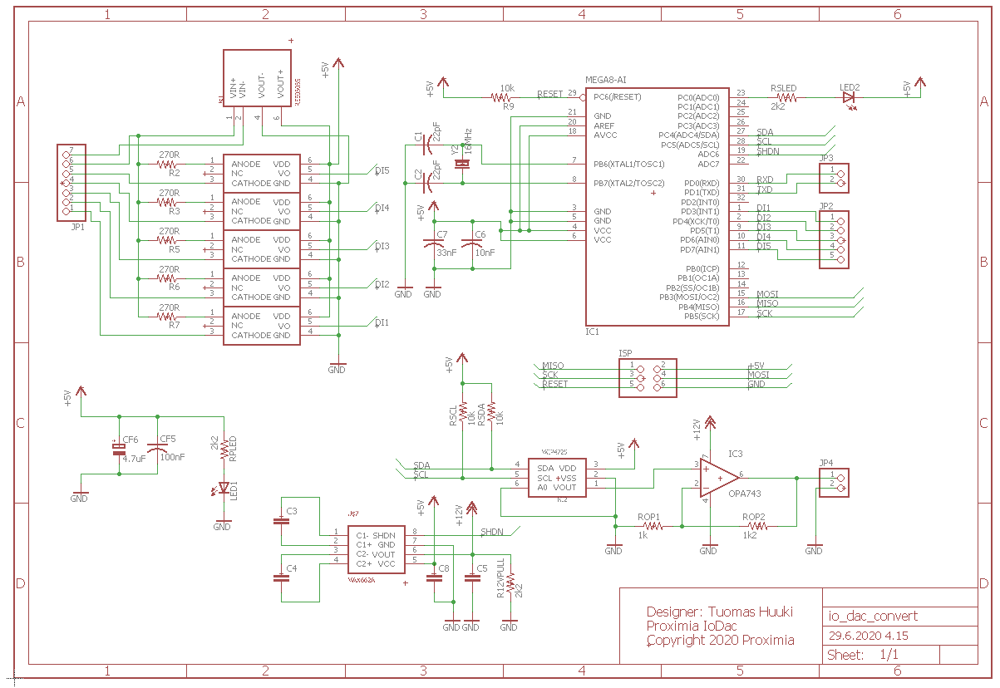
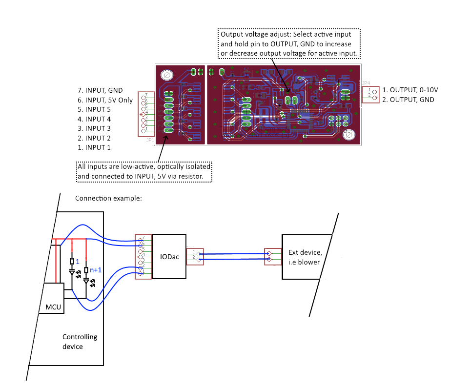

# iodac
The Proximia iodac is an isolated Digital-in to 0-10V out controller for applications that require conversion from a digital signal to a analog voltage output.

Such application are for example AC-blowers that usually need a 0-10V input but the HMI is a button interface.

Features:
* 5V input voltage.
* Fully isolated power supply.
* 5 fully isolated low-active inputs. (5V)
* Each input can be configured to a specific output voltage.
* 1 0-10V output. (25mA max load)

The operating mode currently follows the input active with the highest number input having the highest priority, but
the source can be modified for operation where the output will hold the last value. (Pulsed input signal).

# Schematic

## Pins
### JP1
Inputs 1-5, VCC (+5V, GND) .
### JP2
Debug header for isolated inputs.
### JP3
0-10V output adjust pins.
### JP4
0-10V output.

# Connection example

## Connecting
1. Locate the GND and +5V supply lines in the controlling device.
1. Connect the GND line to JP1.7 and +5V to JP1.6.
1. Locate the outputs (buttons or leds) on the controlling device, and make sure they are low-active.
1. Connect the lowest priority output (i.e. 1) to JP1.1 and then the rest of the outputs as required in order. 
Remember, that the highest number input will have priority. That is, if input 3 is active, input 1 will be ignored.
 
## Adjusting output voltage
1. Connect a multimeter to the output (JP4.1 + JP4.2). Remember to use the correct GND for measurements!
1. Activete the input that is to be adjusted.
1. Optionally connect a button between JP3.1 <-> JP4.2 and JP3.2 <-> JP4.2. A simple wire to toggle the pins can also be used.
1. Measure the output while adjusting the voltage with the buttons (or use the wire).
1. Repeat for each active input.